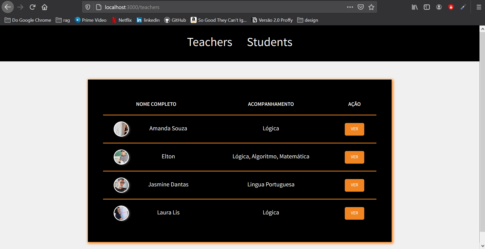

# 🚀 Projeto da [Rocketseat](https://rocketseat.com.br/) - Turma LaunchBase 2020

## 🏋️‍ [Desafio 4-6](https://github.com/rocketseat-education/bootcamp-launchbase-desafios-04/blob/master/desafios/04-6-list-teachers.md): Listagem de professores

---

## 🎯 O desafio teve como objetivo fortalecer os conceitos:
 - Criação de rota;
 - Trabalhar com Table;
 - Passar dados do data.json para front-end;

 ---

## 📑 Descrição do desafio:
Nessa etapa o desafio foi, reformular o index, passando os dados json para a página index em formato de tabela.

 ---

 ## 🎥 Preview:

<h1>
    
</h1>

