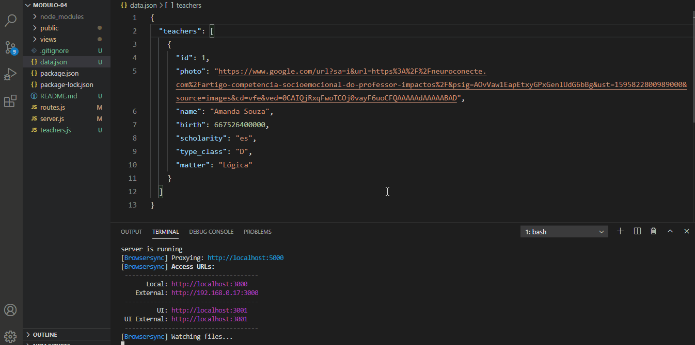

# 🚀 Projeto da [Rocketseat](https://rocketseat.com.br/) - Turma LaunchBase 2020

## 🏋️‍ [Desafio 4-3](https://github.com/Rocketseat/bootcamp-launchbase-desafios-04/blob/master/desafios/04-3-form-and-routes-teacher.md): Formulário e Rota de cadastro do Professor

---

## 🎯 O desafio teve como objetivo fortalecer os conceitos:
 - Receber dados do Front-end com req.body;
 - Validar dados no Back end;
 - Node fs;
 - Callback function;
 - Dados JSON;
 - Estrutura de dados;

 ---

## 📑 Descrição do desafio:
Nessa etapa deve ser criado um formulário de cadastro do professor e uma rota do tipo post que irá realizar as validações e salvar os dados enviados. 

 ---

 ## 🎥 Preview:

<h1>
    
</h1>

