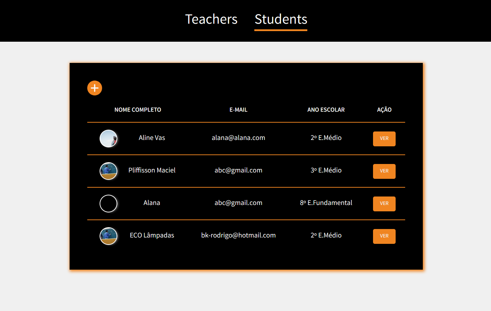

# 🚀 Projeto da [Rocketseat](https://rocketseat.com.br/) - Turma LaunchBase 2020

## 🏋️‍ [Desafio 5-3](https://github.com/rocketseat-education/bootcamp-launchbase-desafios-05/blob/master/desafios/05-3-relacionamentos-filtros-bd.md): Relacionamentos e filtros no BD 

---

## 🎯 O desafio teve como objetivo fortalecer os conceitos:
 - Banco de dados SQL;
 - Method shorthand ES6;
 - Conexão com BD;
 - Relacionamento entre tabelas;
 - Funcionalidade de filtro;

 ---

## 📑 Descrição do desafio:
Criar operações que buscam todos os registros ou apenas um, cria atualiza e deleta um registro através do seu ID.

 ---

 ## 🎥 Preview:

<h1>
    
</h1>

